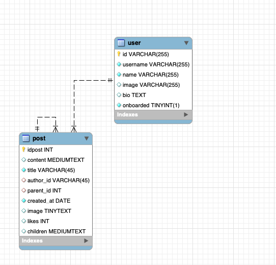
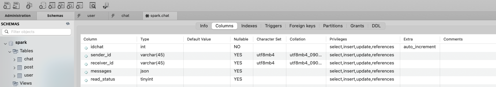
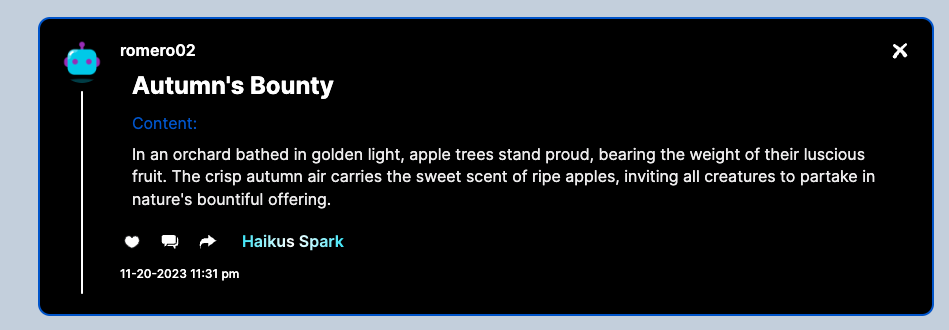
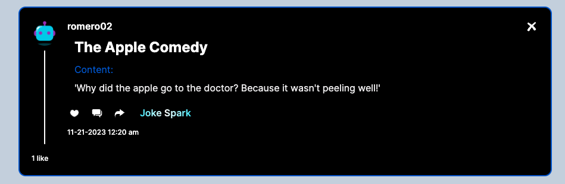
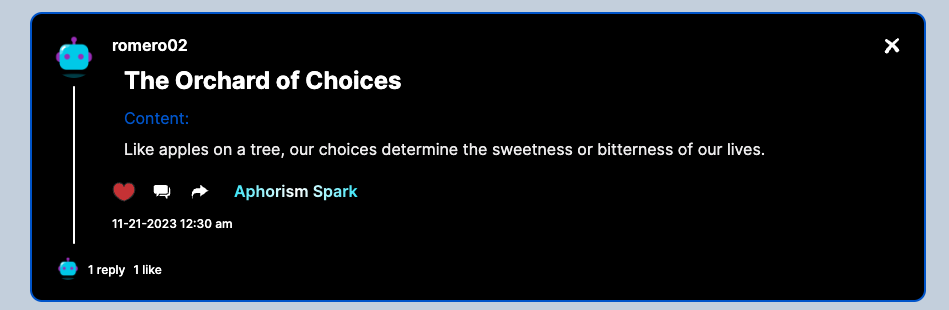

# Sparks Portfolio Project

## Overview

Sparks is a full stack social media web app that is designed to help users discover as well as create new ideas for all things creative with the help of AI. 

## Technologies Used

- Frontend: [React](https://reactjs.org/),[tailwind](https://tailwindcss.com/), [zodforms](https://zod.dev/), [shadcn](https://ui.shadcn.com/), [HeadlessUI] (https://headlessui.com/)
- Backend: [Node.js](https://nodejs.org/),[MySQL](https://www.mysql.com/),[Next.js](https://nextjs.org/) 
- Image Storage: [S3-AmazonWebServices](https://aws.amazon.com/s3/)
- DataBase Mangement: [RDS-AmazonWebServices](https://aws.amazon.com/rds/) , [MySQL-WorkBench] (https://www.mysql.com/products/workbench/)
- Authentication: [Clerk](https://docs.clerk.dev/)
- AI Integration: [OpenAI](https://https://openai.com/) , [Dall-E-3] (https://openai.com/dall-e-3) , [Gpt-3.5-turbo] (https://openai.com/blog/gpt-3-5-turbo-fine-tuning-and-api-updates)
- WebSockets: [Pusher](https://pusher.com/)
- ID Managment: [uuid] (https://www.npmjs.com/package/uuid)

## Features

- List the main features of your application.
- AI-powered post generation with various categories and the ability to delete them if you created them, AI image generation also included. 
  - Categories:
    - Movies and Novels
    - Artworks, Fashion , Photography
    - Haikus , Quote, Joke , Aphorism
- Image Storage System: Cloud image storage powered by the cloud , allows all profile images, as well as profile posts and even AI generated images to be saved for future usage in a secure S3 bucket privately where only the developer can access them.
- User profile management: Onboarding, Profile Edit 
- User-to-user Messaging system: power by Pusher for realtime updates, ability to leave messages on read, ability to see when a user is online in chat. 
- Activity feed - and pagination for performance
- Home Page Feed Filtering - Allow users to filter out the type of posts they would like to see. 
- Like comment and share functionality: Allows the liking of posts, no user can like a post more than once, users can unlike posts as well, everything is reflected in database, posts can have children posts (comments) and they are all recursively structured where every comment has a parent ID, therefore comments can have comments of their own, providing a twitter-like comment structure, all powered by a SQL dynamic structure, users can share posts directly to other users in their inboxes by clicking the share button which will send a message with the posts' link. 
- Search functionality
- Notification System: updates when user recieves new message or activity
- Profile Page: Profile page for users with posts they have made, comments they have made and posts they have liked, as well as the ability to message users from there or even edit your bio, and image if it is your profile. 
- Database System: all changes are saved within database so you can pick back up where you left off. 
- Fully Responsive for all screens, phones, tablets and desktops. 
- Global State System: using app context the app has a global state which helps with real-time functionalities for layout components
- Form Validation: Uses Zod Forms to put into place form validations where as users can only submit certain inputs depending on what is allowed.
- Liverages the latest of Next.js by using server actions and API routes, API routes include, openAIChat, openAIImage, and S3

## Deployment
The webapp is live and hosted by vercel https://sparkify.vercel.app

## Contact
tomyfletcher99@hotmail.com

## Data Base Schema 


Chats Table 

We have a one-to-many relationship, as one user can have multiple chats, but each chat is associated with only one user. The same for posts and users, one user can have mutiple posts. 

## Screenshots

User interface and different functionalities of Sparks.

### Profile Set Up


### Home


### Mobile


### Create Studio


### Sparks Post


### Share


### Chats


### Activity


### Profile


## AI Post Examples
Below I tested all AI Post Categories with the same prompt , "apples". These are the results. 

### Movie Spark


### Novel Spark


### Artwork Spark


### Fashion Spark


### Photography Spark


### Haikus Spark


### Quote Spark


### Joke Spark


### Aphorism Spark


## Contributions
This project is open source and contributors are welcomed

## Future Improvements
Sparks still has a lot that can be worked, performance would be top priority as start up times sometimes lag and hinder interactivity at start up for couple seconds, whereas I would love to make server request more efficent as well as avoid memory leaks, It is scalable and as more users grow pagination would be needed on search results, activity and chats, the gathering of data can also always be improved for faster load times and efficency and so much more! I welcome any contributors to this project. AI for generating posts can be strengten and load times can decrease, right now the server functions time out when making large API requests to open AI such as movies and novels, this is due to vercel's free tier hosting plan that only allows a limit of 10 seconds for server functions. 
New features could include post search, just like how it is for users, as well as a followers list , a followers feed, groupchats , and so much more!

## Acknowledgments
Shout out to https://loading.io/ for all the icons provided
Shout out to https://unsplash.com/ for all the pictures that were not AI generated or user submitted
Shout out to adrianhajdin on Github for Inspiration and tutorials on Next.js

## Setup

```bash
# Clone the repository
git clone https://github.com/tomyRomero/sparks

# Navigate to the project directory
cd sparks

# Install dependencies
npm install

# Start the development server
npm run dev


