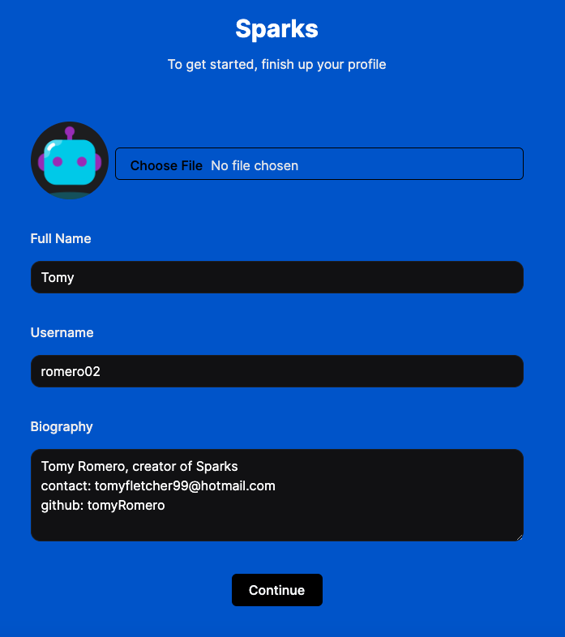
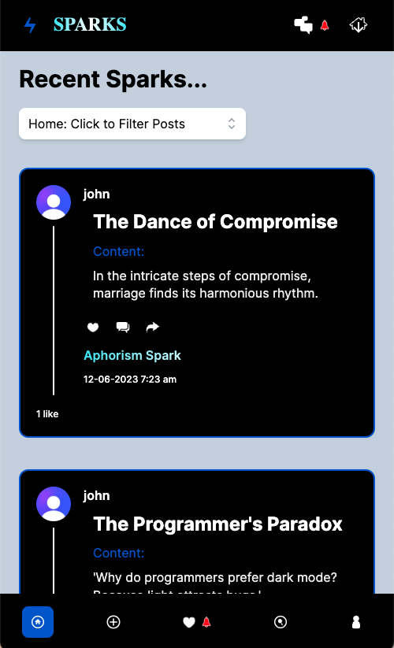
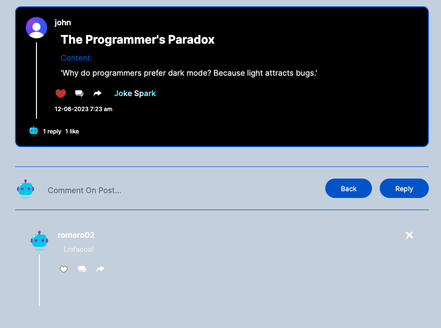

# Sparks Portfolio Project

## Overview

Sparks is a full stack social media web app that is designed to help users discover new ideas with the help of AI. 

## Technologies Used

- Frontend: [React](https://reactjs.org/),[tailwind](https://tailwindcss.com/), [zodforms](https://zod.dev/), [shadcn](https://ui.shadcn.com/), [headlessUI] (https://headlessui.com/)
- Backend: [Node.js](https://nodejs.org/),[MySQL](https://www.mysql.com/),[Next.js](https://nextjs.org/)
- Image Storage: [S3-AmazonWebServices](https://aws.amazon.com/s3/)
- DataBase Mangement: [RDS-AmazonWebServices](https://aws.amazon.com/rds/)
- Authentication: [Clerk](https://docs.clerk.dev/)
- AI Integration: [OpenAI](https://https://openai.com/)
- WebSockets: [Pusher](https://pusher.com/)
- ID Managment: [uuid] (https://www.npmjs.com/package/uuid)

## Features

- List the main features of your application.
  - AI-powered post generation with various categories and the ability to delete them if you created them 
  - User profile management - Onboarding, Profile Edit 
  - User-to-user Messaging system - power by Pusher for realtime updates, ability to leave messages on read, ability to see when a user is online in chat. 
  - Activity feed - with filtering and pagination for performance
  - Like comment and share functionality
  - Search functionality
  - Notification System - updates when user recieves new message or activity
  - Profile Page - Profile page for users with posts they have made, comments they have made and posts they have liked
  - Database System - all changes are saved within database so you can pick back up where you left off. 
  - Fully Responsive for all screens
  - Global State System - using app context the app has a global state which helps with real-time functionalities

## Contact
tomyfletcher99@hotmail.com

## Screenshots

User interface and different functionalities of Sparks.

### Profile Set Up


### Home


### Mobile


### Create Studio


### Sparks Post


### Share


### Chats


### Activity


### Profile


## Deployment
The webapp is live hosted by vercel https://sparkify.vercel.app

## Contributions
This project is open source and contributors are welcomed

## Future Improvements
Sparks still has a lot that can be worked, It is scalable and as more users grow pagination would be added to search results, activity and chats, the gathering of data can also always be imporved for faster load times and efficency and so much more! I welcome any contributors to this project. AI for generating posts cam be strengten and load times can decrease

## Acknowledgments
Shout out to https://loading.io/ for all the icons provided
Shout out to https://unsplash.com/ for all the pictures that were not AI generated or user submitted
Shout out to adrianhajdin on Github for Inspiration and tutorials on Next.js

## Setup

```bash
# Clone the repository
git clone https://github.com/your-username/your-project.git

# Navigate to the project directory
cd your-project

# Install dependencies
npm install

# Start the development server
npm run dev


