# Sparks

A social network for creative ideas. Members post short "sparks", such as movie pitches, book plots, artwork, haiku and jokes. They can draft them with AI, talk them over in threaded comments and message each other live. It's a full-stack portfolio project in two parts:
- a Next.js web app;
- an ASP.NET Core API that owns the data, sign-in, files, AI calls and real-time events.

Sparks began in 2024 as a Next.js app on Clerk, MySQL, S3, Pusher and OpenAI. This version rebuilds it on a stack it runs itself.

## 📋 Contents

- [Screenshots](#screenshots)
- [Features](#features)
- [Architecture](#architecture)
- [Engineering notes](#engineering-notes)
- [Tech stack](#tech-stack)
- [Project structure](#project-structure)
- [Running it](#running-it)
- [Testing and CI](#testing-and-ci)
- [Database schema](#database-schema)
- [Contact](#contact)
- [Acknowledgments](#acknowledgments)

## <a name="screenshots">📸 Screenshots</a>

<table>
  <tr>
    <td>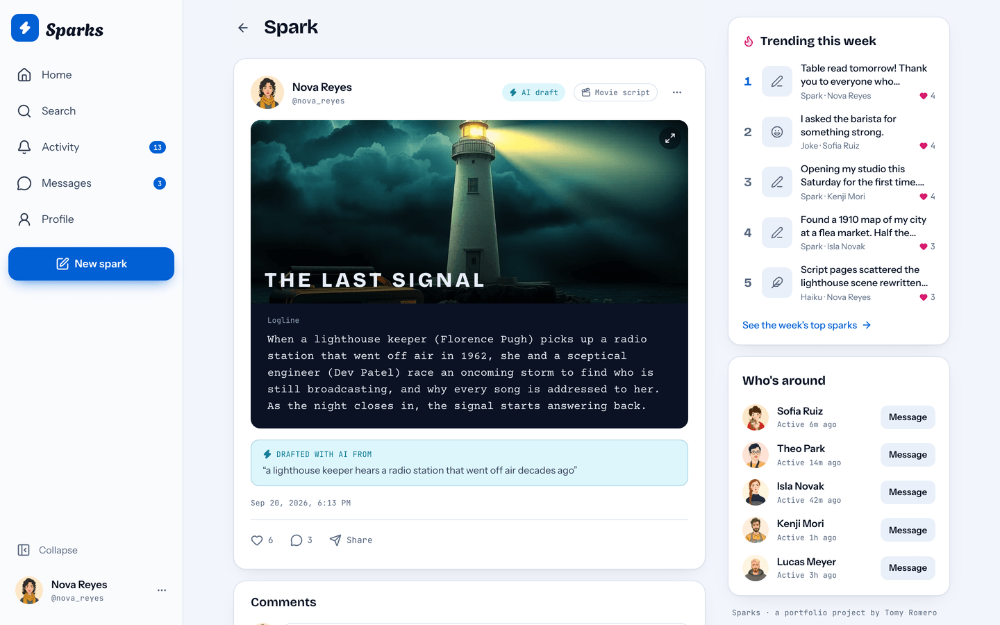</td>
    <td>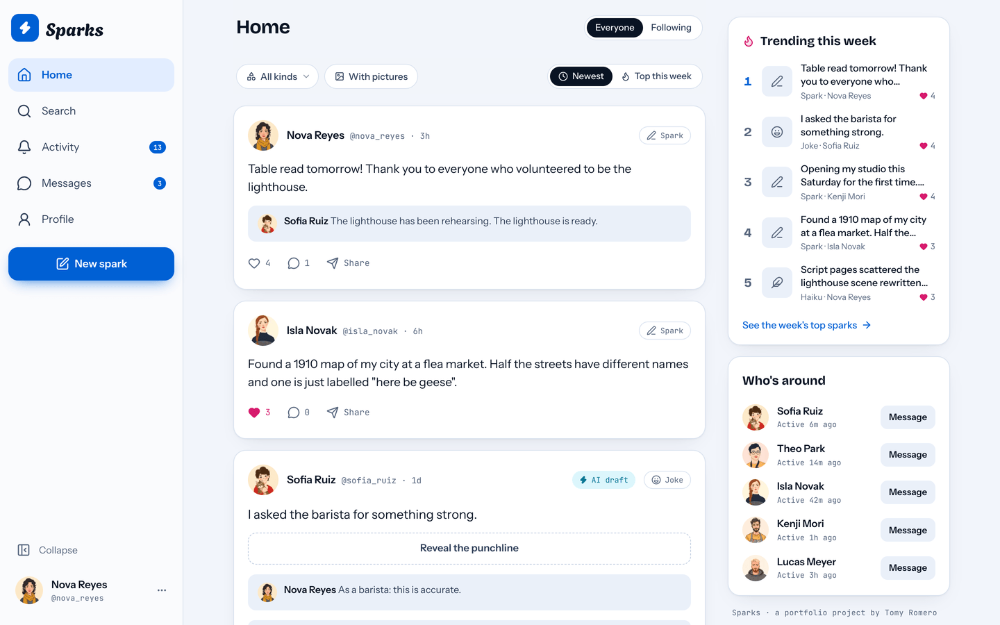</td>
  </tr>
  <tr>
    <td>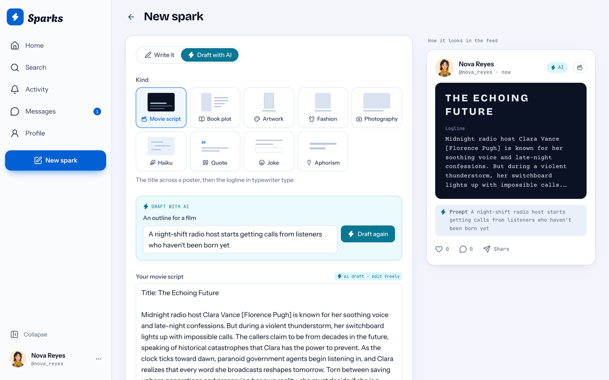</td>
    <td>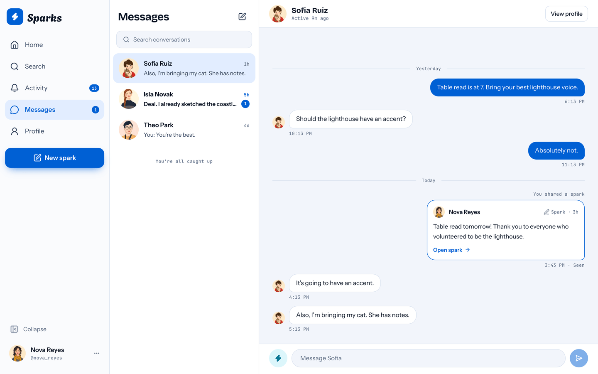</td>
  </tr>
  <tr>
    <td>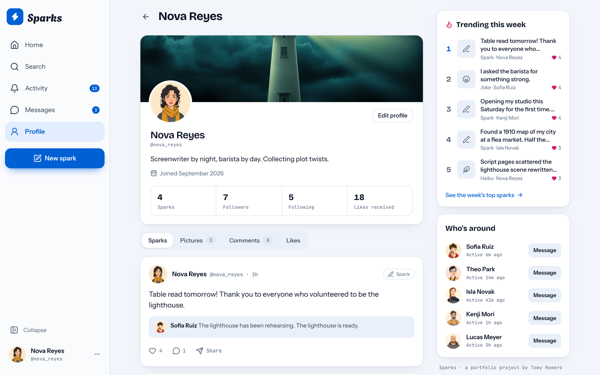</td>
    <td>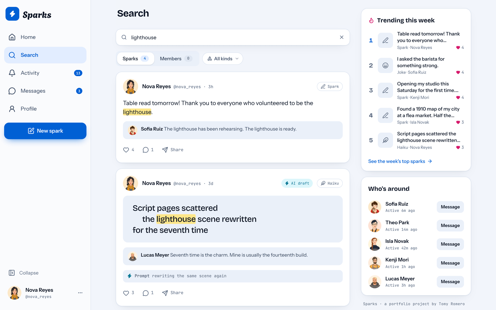</td>
  </tr>
  <tr>
    <td>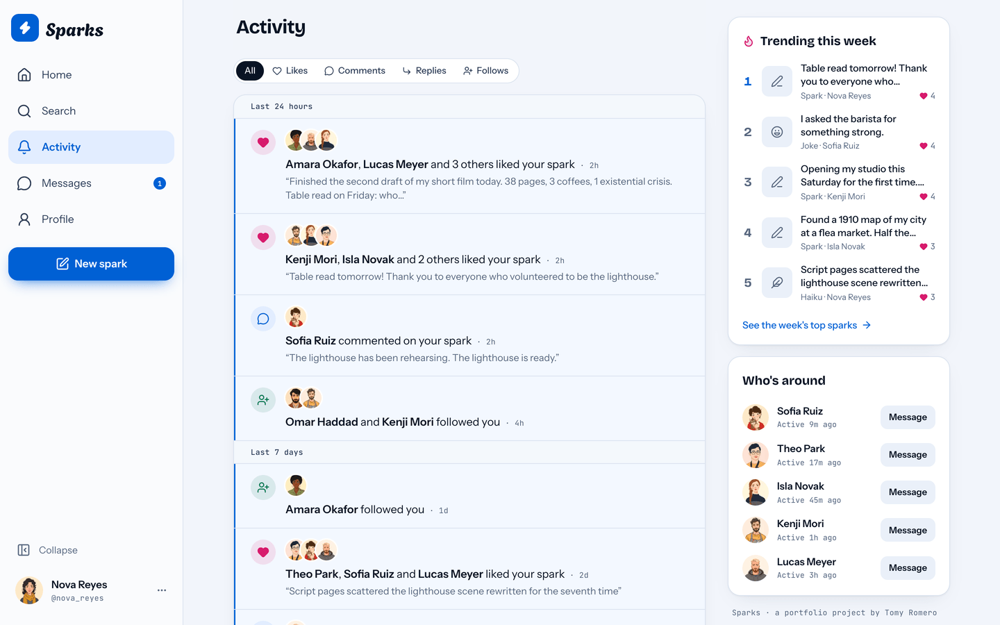</td>
    <td>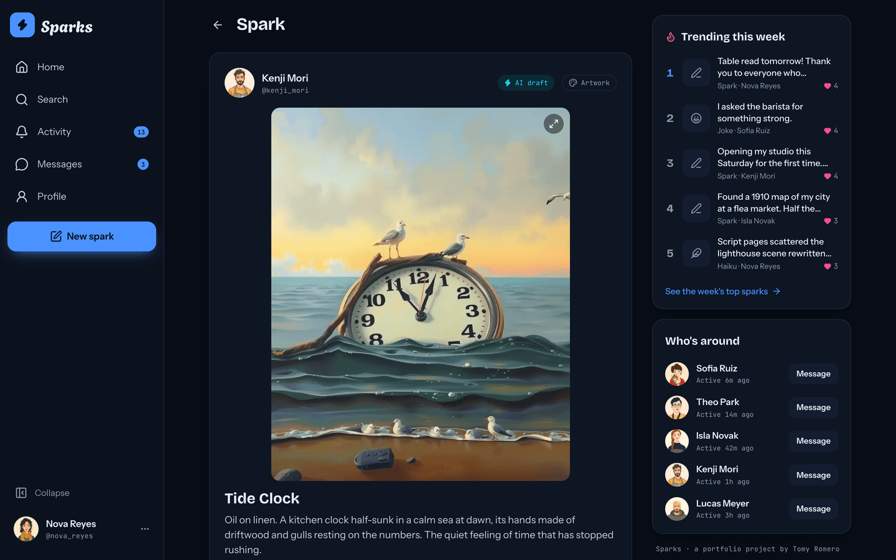</td>
  </tr>
</table>

<p align="center">
  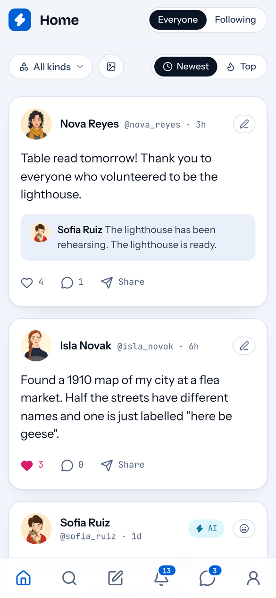
  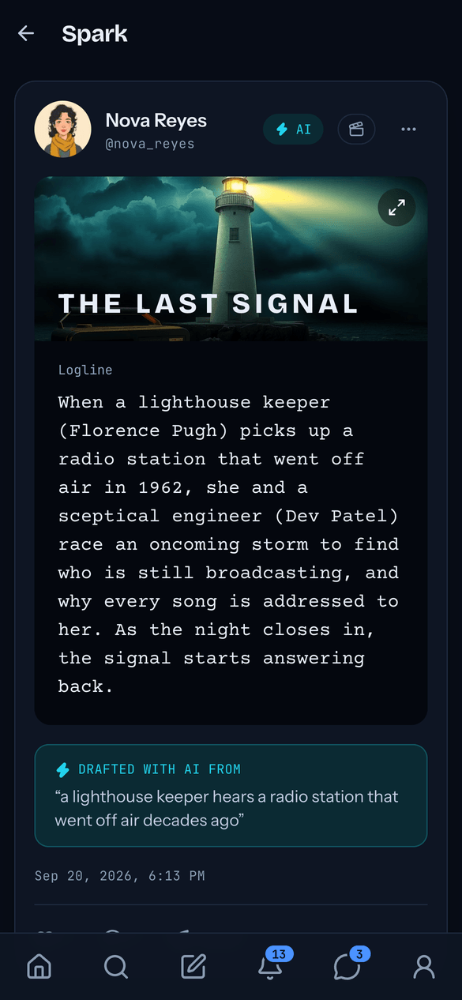
  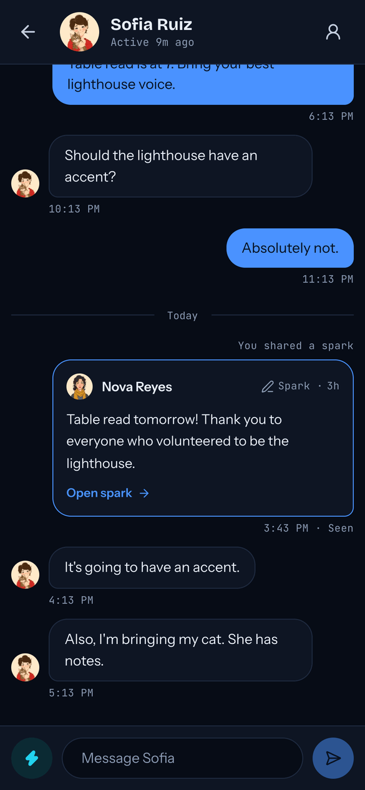
</p>

## <a name="features">🚀 Features</a>

- **Sparks of every kind:** plain posts, movie scripts, book plots, artwork, fashion, photography, haiku, quotes, jokes and aphorisms. Each kind has its own card:
  - a movie script plays on a dark screen with its title across the poster;
  - a book plot sits beside its cover;
  - a haiku is set as a poem;
  - a joke keeps its punchline back until you tap.
- **Pictures:** on a spark's page, a tap opens its picture whole, and a double tap likes the spark.
- **Drafting with AI:**
  - Pick a kind and give it one line. Google Gemini writes a draft to edit, and Cloudflare Workers AI paints a picture for the visual kinds.
  - The spark keeps the idea it came from, shown under it in the feed.
  - Without API keys, built-in sample providers stand in, so everything runs offline.
  - Unshared drafts are kept in the browser, so a refresh loses nothing.
- **Feed:**
  - Everyone or just the people you follow, filtered by kind or to sparks with pictures, newest first or the week's most liked.
  - It scrolls without end and keeps its filters in the URL.
- **Threads and likes:**
  - Comments with nested replies, and each comment has a page of its own.
  - A like shows at once, and every list showing that spark or comment stays in step.
  - Authors can edit and delete; deleting a comment removes its replies.
- **Messages:**
  - A two-pane messenger over SignalR, with conversations grouped by day.
  - Typing indicators, "Seen" receipts and unread badges.
  - Any spark can be shared into a chat.
- **Activity:** likes, comments, replies and follows, grouped ("Kenji, Isla and 2 others liked your spark"), with filters, an unread count and live notices.
- **People:** profiles with a cover taken from the member's most liked picture, plus their sparks, pictures, comments and likes. Followers and following lists, suggestions of who to follow, and who's online or when they were last around.
- **Search:** sparks and members, filtered by kind, with matches highlighted and recent searches remembered. Press `/` to search from anywhere.
- **Accounts:** sign-up, sign-in with an email or a username, and password reset, built from scratch rather than on a hosted auth service.
- **Feel:** Light, Dark or System appearance, keyboard and screen reader support throughout, and a layout that works from a phone to a wide screen.

## <a name="architecture">🏗️ Architecture</a>

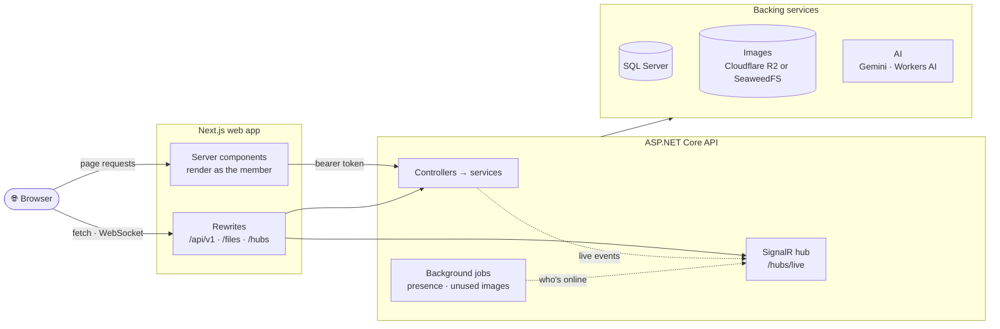
```mermaid
flowchart LR
    Browser(["🌐 Browser"])

    subgraph Web["Next.js web app"]
        direction TB
        Pages["Server components<br/>render as the member"]
        Rewrites["Rewrites<br/>/api/v1 · /files · /hubs"]
    end

    subgraph Api["ASP.NET Core API"]
        direction TB
        Controllers["Controllers → services"]
        Hub["SignalR hub<br/>/hubs/live"]
        Jobs["Background jobs<br/>presence · unused images"]
    end

    subgraph Backing["Backing services"]
        direction TB
        DB[("SQL Server")]
        Images[("Images<br/>Cloudflare R2 or SeaweedFS")]
        AI["AI<br/>Gemini · Workers AI"]
    end

    Browser -->|page requests| Pages
    Browser -->|fetch · WebSocket| Rewrites
    Pages -->|bearer token| Controllers
    Rewrites --> Controllers
    Rewrites --> Hub
    Controllers -.->|live events| Hub
    Jobs -.->|who's online| Hub
    Api --> Backing
```

- **The API owns everything.** Data, validation, sign-in, files, AI calls and real-time events all live in the API. The web app keeps no data of its own.
- **One origin for the browser.**
  - Next.js rewrites `/api/v1`, `/files` and `/hubs` to the API, so the browser only ever talks to the web app.
  - The HttpOnly session cookies travel with every request and WebSocket, and the browser never makes a cross-origin call.
- **Server-rendered first pages.** Server components call the API as the signed-in member and render the first page of each list. In the browser, TanStack Query takes over paging, optimistic likes and cache updates.
- **Real-time over SignalR.** Every write is an ordinary request, validated and saved first; the hub only carries the events that follow, and the typing hint. So each write has one path through validation.

How a message travels:

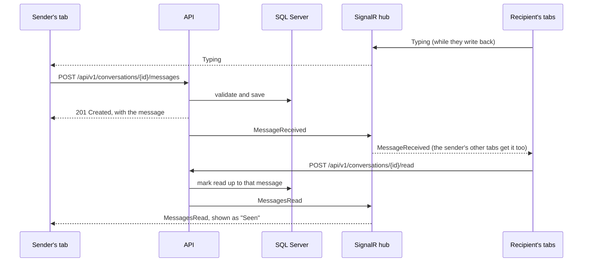
```mermaid
sequenceDiagram
    participant Sender as Sender's tab
    participant API
    participant DB as SQL Server
    participant Hub as SignalR hub
    participant Recipient as Recipient's tabs
    Recipient->>Hub: Typing (while they write back)
    Hub-->>Sender: Typing
    Sender->>API: POST /api/v1/conversations/{id}/messages
    API->>DB: validate and save
    API-->>Sender: 201 Created, with the message
    API->>Hub: MessageReceived
    Hub-->>Recipient: MessageReceived (the sender's other tabs get it too)
    Recipient->>API: POST /api/v1/conversations/{id}/read
    API->>DB: mark read up to that message
    API->>Hub: MessagesRead
    Hub-->>Sender: MessagesRead, shown as "Seen"
```

## <a name="engineering-notes">🧠 Engineering notes</a>

**Authentication.**
- Passwords are hashed with BCrypt. Access tokens are short-lived JWTs.
- Refresh tokens rotate on every use and are stored only as SHA-256 hashes. Reusing a rotated token signs the account out everywhere, with a short grace period so parallel server renders don't trip it.
- Sign-in has account lockout and per-IP rate limits. Its errors never reveal whether an account exists, and an unknown account still costs a full BCrypt check, so the timing doesn't either.
- Every endpoint requires sign-in unless it opts out, and a test calls every route as a guest to keep it that way.

**Browser security.**
- Both tokens live in HttpOnly `SameSite=Lax` cookies.
- CORS allows only the web app, and an Origin check refuses writes and WebSocket handshakes from other sites.
- Every page carries a Content Security Policy with a fresh nonce, so only scripts the app rendered can run, and no other site can frame it.
- Uploads are identified by their first bytes, not their name or declared type, and SVG is refused.

**Schema.**
- Likes, comments and messages each have their own rows; the 2024 version kept them as comma-separated ids and JSON in text columns.
- A unique key makes a double like impossible.
- A check constraint and a unique index allow one conversation per pair of members, and none with yourself.
- Like and comment counts are computed in queries, so they can't drift.
- Unread activity is one timestamp per member, not a flag on every row.

**Concurrency.**
- An edit or delete checks authorship in the same statement that writes, so nothing can change in between.
- Deleting a comment removes its replies in one recursive statement with lock hints, so a reply written at the same moment gets a 404 instead of breaking the delete.
- Foreign-key and unique-key races become 404s and no-ops, not 500s.

**Presence.**
- Connections are counted per member in memory, so several tabs count once.
- A member stays online for a short grace period after their last tab closes, so a reload or a token refresh doesn't read as leaving. A background job then saves when they were last seen and tells everyone.
- Memory is enough for one API instance; more would need a shared store, as SignalR would need a backplane.

**Storage.**
- Images go to a private bucket through the S3 API, and the API serves them at `/files`, so the browser stays on one origin and the bucket is never public.
- A key holds the owner's id and a random name, and a key's content never changes, so browsers can cache images for good.
- A background job deletes images that no spark or avatar uses once they've gone unused for a while: pictures painted for a spark that was never shared, and files whose delete failed.

**Paging.** Every list pages by cursor rather than page number, so new sparks never shift a page. Some lists aren't ordered by a single id: activity, which merges four tables, the inbox, the follow lists and the week's top sparks. Those carry the whole sort key in an opaque cursor.

**Errors.** Every error is an RFC 9457 problem details response, with a machine-readable code (`POST_NOT_FOUND`, `PROMPT_DECLINED`) and a trace id that matches the logs. Expected outcomes, such as a 404 or a request the client abandoned, aren't logged as errors.

**Front end.**
- React server components and `useActionState` forms, mapped to the API's problem details.
- One SignalR connection per tab, which recovers from expired tokens and refetches what it missed.
- Accessibility: a skip link, visible focus throughout, `aria-pressed` toggles, radio-group pickers and announced new messages.

## <a name="tech-stack">⚙️ Tech stack</a>

| Part | Built with |
|---|---|
| Web | Next.js 16, React 19, TypeScript, Tailwind CSS 4, TanStack Query, Radix UI, `@microsoft/signalr` |
| API | ASP.NET Core on .NET 10, Entity Framework Core with SQL Server, SignalR, Serilog, OpenAPI, BCrypt, the AWS SDK for S3 |
| Database | SQL Server 2025 in Docker, EF Core migrations |
| Images | Cloudflare R2, or SeaweedFS for local development (both speak the S3 API) |
| AI | Google Gemini for text, Cloudflare Workers AI (FLUX.1 schnell) for pictures, built-in sample providers |
| Tests | xUnit v3, FluentAssertions, WebApplicationFactory, Testcontainers; Vitest; Playwright with axe; Lighthouse CI |
| Tooling | Docker Compose, GitHub Actions, Dependabot, ESLint, Prettier, `dotnet format` |

## <a name="project-structure">🗂️ Project structure</a>

```
src/backend/
  Sparks.Api/           The API, a folder per feature
    Auth/ Posts/ Users/ Activity/ Chat/ Presence/ Search/ Storage/ Ai/ Realtime/
    Common/             Errors, paging, security middleware, rate limits
    Migrations/         EF Core migrations
    Seeding/            Demo data (dotnet run -- seed)
  Sparks.Tests/         Integration tests, in the same feature folders
src/frontend/
  app/                  Routes: (auth) for signed-out pages, (app) for the rest
  components/           UI, by feature
  lib/                  The typed API client, queries and cache updates, the SignalR connection
  e2e/                  Playwright tests
images/screenshots/     The pictures in this README
scripts/setup-dev.sh    Generates local secrets
docker-compose.yml      SQL Server and an S3 bucket for development
.github/workflows/      CI
```

## <a name="running-it">🛠️ Running it</a>

### What you need

- [Docker](https://www.docker.com/). SQL Server needs about 2 GB of Docker's memory. Microsoft publishes SQL Server for Intel only. On Apple silicon, first turn on "Use Rosetta for x86_64/amd64 emulation on Apple Silicon" in Docker Desktop's settings.
- The [.NET 10 SDK](https://dotnet.microsoft.com/download) and [Node.js](https://nodejs.org/) 24.

Then clone the repository: `git clone https://github.com/tomyRomero/sparks`

### Start it

1. Run `./scripts/setup-dev.sh`. It's safe to re-run, and it generates local secrets:
   - in `.env`: the database password and the bucket's keys;
   - in .NET user-secrets: the connection string, the JWT key, the demo password and the bucket settings.
2. Run `docker compose up -d --wait`. This starts SQL Server on port 14332 and an S3 bucket on port 8333, both reachable only from your computer. The first start takes a few minutes on Apple silicon.
3. Optionally, fill the database with demo members, sparks, threads, likes, follows and chats: `dotnet run --project src/backend/Sparks.Api -- seed`.
4. Run `dotnet run --project src/backend/Sparks.Api`. The API listens on port 5100 and applies migrations on startup.
5. In a second terminal, run `cd src/frontend && npm ci && npm run dev`. The web app is then on http://localhost:3100.

To use the demo data, sign in as `nova_reyes` with the password stored as `Seed:Password` (see `dotnet user-secrets list --project src/backend/Sparks.Api`). Every demo member shares that password. Password-reset emails are printed to the API's console.

### Images

Out of the box, images go to the SeaweedFS bucket that `docker compose` starts, which speaks the same S3 API as R2.

To use Cloudflare R2 instead:
1. Create a bucket, and leave public access off: the API serves the images itself.
2. Create an R2 API token with Object Read & Write on that bucket only.
3. Store the bucket's settings in user-secrets:
   ```
   cd src/backend/Sparks.Api
   dotnet user-secrets set "Storage:S3:ServiceUrl" "https://<account id>.r2.cloudflarestorage.com"
   dotnet user-secrets set "Storage:S3:Bucket" "<bucket>"
   dotnet user-secrets set "Storage:S3:AccessKeyId" "<access key id>"
   dotnet user-secrets set "Storage:S3:SecretAccessKey" "<secret access key>"
   ```

To keep images in a folder instead, for working offline, set `Storage:Provider` to `Local`.

The API deletes images its database doesn't use, so give each database its own bucket or folder.

### AI providers

Out of the box, drafts come from hand-written samples and pictures are gradients made from the prompt. To use real models, store the keys in user-secrets. `src/backend/Sparks.Api/secrets.example.json` lists every setting. Both providers have free tiers.

```
cd src/backend/Sparks.Api

# Text: an API key from Google AI Studio
dotnet user-secrets set "Ai:TextProvider" "Gemini"
dotnet user-secrets set "Ai:Gemini:ApiKey" "<key>"

# Pictures: a Cloudflare account id and a Workers AI API token
dotnet user-secrets set "Ai:ImageProvider" "Cloudflare"
dotnet user-secrets set "Ai:Cloudflare:AccountId" "<account id>"
dotnet user-secrets set "Ai:Cloudflare:ApiToken" "<token>"
```

The API checks the chosen providers' settings at startup. The seeder paints with the same image provider, so a database seeded with Cloudflare set up gets generated pictures.

## <a name="testing-and-ci">✅ Testing and CI</a>

- **API:** `dotnet test --solution sparks.slnx`.
  - The tests run each feature over HTTP through `WebApplicationFactory`, against a real SQL Server and S3 bucket that Testcontainers starts and removes. Docker must be running.
  - They cover token rotation and reuse, lockout, authorship, cascading deletes, race outcomes, cursor paging, upload sniffing, rate limits and SignalR delivery.
  - One test calls every route as a guest, so an endpoint can't be left open by mistake.
- **Web:** `cd src/frontend`, then `npm test` (Vitest), `npm run lint`, `npm run format:check` and `npm run typecheck`.
- **End to end:** `npm run e2e`. Playwright drives Chrome through a running stack (the web app on 3100, or `E2E_BASE_URL`), with axe checks on every main page in light and dark.

On every push and pull request, GitHub Actions:
- builds, lints, checks formatting and tests the API and the web app;
- starts the whole stack with demo data;
- runs the browser tests, then a Lighthouse budget for performance and accessibility.

## <a name="database-schema">📊 Database schema</a>

Sparks, comments, likes, follows and messages:

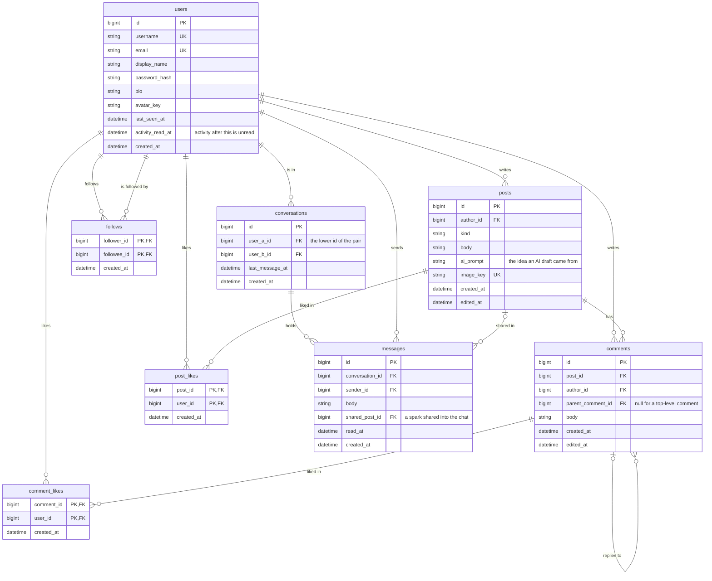
```mermaid
erDiagram
    users ||--o{ posts : writes
    users ||--o{ comments : writes
    posts ||--o{ comments : has
    comments |o--o{ comments : "replies to"
    users ||--o{ post_likes : likes
    posts ||--o{ post_likes : "liked in"
    users ||--o{ comment_likes : likes
    comments ||--o{ comment_likes : "liked in"
    users ||--o{ follows : follows
    users ||--o{ follows : "is followed by"
    users ||--o{ conversations : "is in"
    conversations ||--o{ messages : holds
    users ||--o{ messages : sends
    posts |o--o{ messages : "shared in"

    users {
        bigint id PK
        string username UK
        string email UK
        string display_name
        string password_hash
        string bio
        string avatar_key
        datetime last_seen_at
        datetime activity_read_at "activity after this is unread"
        datetime created_at
    }
    posts {
        bigint id PK
        bigint author_id FK
        string kind
        string body
        string ai_prompt "the idea an AI draft came from"
        string image_key UK
        datetime created_at
        datetime edited_at
    }
    comments {
        bigint id PK
        bigint post_id FK
        bigint author_id FK
        bigint parent_comment_id FK "null for a top-level comment"
        string body
        datetime created_at
        datetime edited_at
    }
    post_likes {
        bigint post_id PK, FK
        bigint user_id PK, FK
        datetime created_at
    }
    comment_likes {
        bigint comment_id PK, FK
        bigint user_id PK, FK
        datetime created_at
    }
    follows {
        bigint follower_id PK, FK
        bigint followee_id PK, FK
        datetime created_at
    }
    conversations {
        bigint id PK
        bigint user_a_id FK "the lower id of the pair"
        bigint user_b_id FK
        datetime last_message_at
        datetime created_at
    }
    messages {
        bigint id PK
        bigint conversation_id FK
        bigint sender_id FK
        string body
        bigint shared_post_id FK "a spark shared into the chat"
        datetime read_at
        datetime created_at
    }
```

Sign-in:

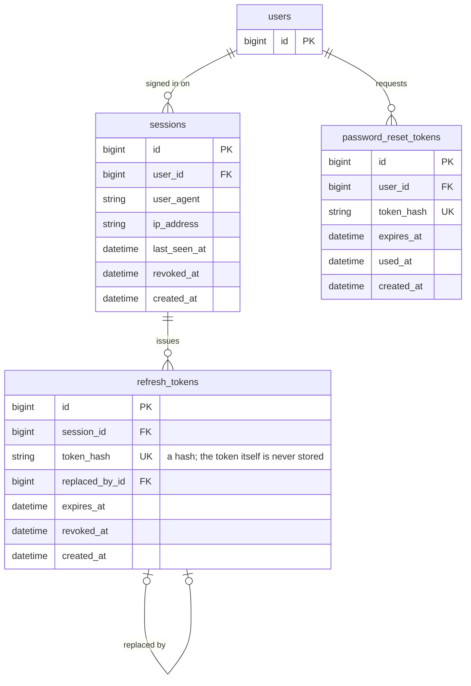
```mermaid
erDiagram
    users ||--o{ sessions : "signed in on"
    sessions ||--o{ refresh_tokens : issues
    refresh_tokens |o--o| refresh_tokens : "replaced by"
    users ||--o{ password_reset_tokens : requests

    users {
        bigint id PK
    }
    sessions {
        bigint id PK
        bigint user_id FK
        string user_agent
        string ip_address
        datetime last_seen_at
        datetime revoked_at
        datetime created_at
    }
    refresh_tokens {
        bigint id PK
        bigint session_id FK
        string token_hash UK "a hash; the token itself is never stored"
        bigint replaced_by_id FK
        datetime expires_at
        datetime revoked_at
        datetime created_at
    }
    password_reset_tokens {
        bigint id PK
        bigint user_id FK
        string token_hash UK
        datetime expires_at
        datetime used_at
        datetime created_at
    }
```

## <a name="contact">📫 Contact</a>

Made by Tomy F. Romero. Questions about the project are welcome at tomyfletcher99@hotmail.com.

[](https://www.linkedin.com/in/tomyromero/)
[](https://tomyromero.vercel.app)

Released under the [MIT License](license).

## <a name="acknowledgments">🙌 Acknowledgments</a>

- [Google Gemini](https://ai.google.dev/) for drafts, and [FLUX.1 schnell](https://huggingface.co/black-forest-labs/FLUX.1-schnell) on [Cloudflare Workers AI](https://developers.cloudflare.com/workers-ai/) for pictures and the demo members' portraits.
- [Lucide](https://lucide.dev/) for the icons, and [Radix UI](https://www.radix-ui.com/) for menus and dialogs.
- [Instrument Sans](https://fonts.google.com/specimen/Instrument+Sans), [Bricolage Grotesque](https://fonts.google.com/specimen/Bricolage+Grotesque), [JetBrains Mono](https://fonts.google.com/specimen/JetBrains+Mono), [Courier Prime](https://fonts.google.com/specimen/Courier+Prime) and [Agbalumo](https://fonts.google.com/specimen/Agbalumo) from Google Fonts.
