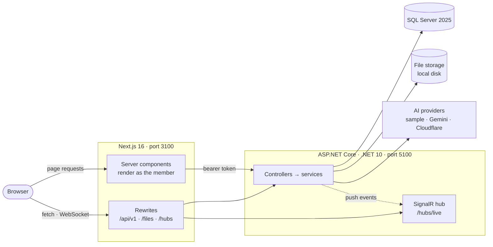

# Sparks

A social network for creative ideas: people post short "sparks" (film and novel outlines, art and fashion concepts, haiku, jokes, aphorisms), draft them with AI help, discuss them in threaded comments and message each other in real time.

Sparks started in 2024 as a Next.js app built on Clerk, MySQL on RDS, S3, Pusher and OpenAI. This version rebuilds it on a stack I run myself: an ASP.NET Core API that owns the data, authentication and real-time, and a Next.js front end that is purely a client of that API. It runs locally with no cloud accounts, and the AI providers are optional.

## Features

- **Sparks of ten kinds, each with its own card.** Plain posts plus nine creative kinds, in a filterable, infinitely scrolling feed. A movie script plays on a dark screen with its title over the poster, a book plot sits beside its cover, a haiku is set as a poem, and a joke keeps its punchline back until you tap.
- **AI drafting.** Describe an idea and get a draft to edit before posting; visual kinds also get a generated picture. Text comes from Google Gemini, pictures from Cloudflare Workers AI, or from built-in sample providers when no keys are set.
- **Threaded comments.** Replies nest under comments, and each comment has its own page. Authors can edit and delete their own posts and comments, and a delete removes the whole subtree.
- **Likes.** Posts and comments update immediately, and every list showing the item stays in sync.
- **Live messaging.** A two-pane messenger over SignalR: conversations grouped by day, typing indicators, read receipts, unread badges, messages that show the moment they're sent, and any spark shared straight into a chat.
- **Online status.** Who's online now and when everyone else was last around, kept current over the same live connection.
- **Activity.** Who liked or replied to your sparks and comments, with an unread count.
- **Profiles and search.** Profile pages with posts, comments and likes; avatar upload; search across sparks and members.
- **Accounts.** Sign-up, sign-in and password reset, built from scratch rather than on a hosted auth service.

## Architecture


```mermaid
flowchart LR
    browser([Browser])

    subgraph web["Next.js 16 · port 3100"]
        pages["Server components<br/>render as the member"]
        rewrites["Rewrites<br/>/api/v1 · /files · /hubs"]
    end

    subgraph api["ASP.NET Core · .NET 10 · port 5100"]
        controllers["Controllers → services"]
        hub["SignalR hub<br/>/hubs/live"]
    end

    sql[("SQL Server 2025")]
    storage[("File storage<br/>local disk")]
    ai["AI providers<br/>sample · Gemini · Cloudflare"]

    browser -->|page requests| pages
    browser -->|fetch · WebSocket| rewrites
    pages -->|bearer token| controllers
    rewrites --> controllers
    rewrites --> hub
    controllers --> sql
    controllers --> storage
    controllers --> ai
    controllers -.->|push events| hub
```

- **The API owns everything.** Data, validation, authentication, file storage, AI calls and real-time events all live in the ASP.NET Core API. The web app holds no data of its own.
- **One origin for the browser.** Next.js rewrites `/api/v1`, `/files` and `/hubs` to the API, so the browser only ever talks to the web app. HttpOnly session cookies travel with every request and WebSocket, and the browser never makes a cross-origin call.
- **Server-rendered first pages.** Server components call the API as the signed-in member and render the first page of each list. TanStack Query takes over in the browser for paging, optimistic likes and cache updates.
- **Real-time over SignalR.** Messages are sent with a normal POST, validated and saved, then pushed to the recipient's open tabs. The hub only carries events and the typing hint, so every write has one validation path.

## Engineering notes

**Authentication.** BCrypt password hashes, short-lived JWT access tokens and 30-day refresh tokens that rotate on every use and are stored only as SHA-256 hashes. Reusing a rotated token signs the account out everywhere, with a short grace period so parallel server-side renders don't trip it. Sign-in has lockout and per-IP rate limits, error messages never reveal whether an account exists, and a missing account still costs a full BCrypt check so timing doesn't either. Every endpoint requires sign-in unless it opts out.

**Browser security.** Both tokens live in HttpOnly `SameSite=Lax` cookies. CORS allows only the web app, and an Origin check refuses writes and WebSocket handshakes sent from other sites. Uploads are identified by their first bytes, not their name or declared type, and SVG is refused.

**Schema.** Likes, comments and messages each have their own rows; the 2024 version kept them as comma-separated ids and JSON in text columns. A unique key makes a double like impossible, and a check constraint plus a unique index allow one conversation per pair of members and none with yourself. Like and comment counts are computed in queries, so they can't drift. Unread activity is a single timestamp per member rather than a flag on every row.

**Concurrency.** An edit or delete checks authorship inside the same statement that writes, so nothing can change between the check and the write. Deleting a comment removes its replies in one recursive statement with lock hints, so a reply written at the same moment gets a 404 instead of breaking the delete. Foreign-key and unique-key races become 404s and no-ops, not 500s.

**Presence.** Connections are counted per member in memory, so several tabs count once. A member stays online for a short grace period after their last connection closes, so a page reload or a token refresh doesn't read as leaving and coming back; a background sweep then saves when they were last seen and tells everyone. One instance's memory is enough for one API instance; more would need a shared store, as SignalR would need a backplane.

**Paging.** Every list pages by cursor rather than page number, so new posts never shift a page. Activity merges three tables, so its cursor carries the whole sort key, encoded as an opaque token.

**Errors.** Every error is an RFC 9457 problem details response with a machine-readable code (`POST_NOT_FOUND`, `PROMPT_DECLINED`) and a trace id that matches the logs. Expected outcomes such as a 404 or a request the client abandoned aren't logged as errors.

**Front end.** Next.js 16 with React 19 server components, `useActionState` forms mapped to the API's problem details, and one SignalR connection per tab that recovers from expired tokens and refetches what it missed. Keyboard and screen-reader support includes a skip link, visible focus throughout, `aria-pressed` toggles, radio-group pickers and announced new messages.

## Tech stack

| | |
|---|---|
| **Web** | Next.js 16, React 19, TypeScript, Tailwind CSS 4, TanStack Query 5, Radix UI, `@microsoft/signalr` |
| **API** | ASP.NET Core on .NET 10, EF Core 10, SignalR, Serilog, OpenAPI |
| **Database** | SQL Server 2025 in Docker, EF Core migrations |
| **Auth** | JWT access tokens, rotating refresh tokens, BCrypt |
| **AI** | Google Gemini (text), Cloudflare Workers AI with FLUX.1 schnell (images), sample providers |
| **Tests** | xUnit v3, FluentAssertions, WebApplicationFactory, Testcontainers (SQL Server), Vitest |
| **Tooling** | GitHub Actions CI, ESLint, Prettier, `dotnet format`, Dependabot |

## Running locally

You need Docker Desktop, the .NET 10 SDK and Node.js 24. The ports are SQL Server 14332, API 5100 and web 3100, all bound to localhost.

```bash
# 1. Generate local secrets: a database password in .env, and the connection
#    string, JWT key and demo password in .NET user-secrets. Safe to re-run.
./scripts/setup-dev.sh

# 2. Start SQL Server. The first start takes a few minutes on Apple Silicon,
#    where the image runs under emulation.
docker compose up -d --wait

# 3. Optional: fill the database with two weeks of demo members, sparks,
#    threads, likes and conversations.
dotnet run --project src/backend/Sparks.Api -- seed

# 4. Run the API on http://localhost:5100. It applies migrations on start.
dotnet run --project src/backend/Sparks.Api

# 5. In a second terminal, run the web app on http://localhost:3100.
cd src/frontend
npm ci
npm run dev
```

To use the demo data, sign in as `nova_reyes` with the password stored as `Seed:Password` (`dotnet user-secrets list --project src/backend/Sparks.Api`). Every demo member shares that password. Password-reset emails are printed to the API console.

### AI providers

Out of the box, drafts come from hand-written samples and pictures are gradients generated from the prompt, so everything works offline. To use real models, store the keys in user-secrets; both providers have free tiers.

```bash
cd src/backend/Sparks.Api

# Text: an API key from Google AI Studio
dotnet user-secrets set "Ai:TextProvider" "Gemini"
dotnet user-secrets set "Ai:Gemini:ApiKey" "<key>"

# Pictures: a Cloudflare account id and a Workers AI API token
dotnet user-secrets set "Ai:ImageProvider" "Cloudflare"
dotnet user-secrets set "Ai:Cloudflare:AccountId" "<account id>"
dotnet user-secrets set "Ai:Cloudflare:ApiToken" "<token>"
```

The API checks the chosen providers' settings at startup. The seeder uses the same image provider, so a database seeded after setting the Cloudflare keys gets generated pictures.

## Tests

```bash
# API: integration tests against a real SQL Server that Testcontainers
# starts and removes (Docker must be running).
dotnet test --solution sparks.slnx

# Web: unit tests, lint, formatting and types.
cd src/frontend
npm test
npm run lint
npm run format:check
npm run typecheck
```

The API tests run each feature over HTTP through `WebApplicationFactory` against a real database, covering the rules above: token rotation and reuse, authorship, cascading deletes, race outcomes, cursor paging, upload sniffing, rate limits and SignalR delivery. CI runs both suites on pushes and pull requests.

## Project layout

```
src/
├── backend/
│   ├── Sparks.Api/         One project, a folder per feature
│   │   ├── Auth/  Posts/  Users/  Activity/  Chat/  Presence/  Storage/  Ai/  Realtime/
│   │   ├── Common/         Errors, paging, security middleware, rate limits
│   │   ├── Migrations/     EF Core migrations
│   │   └── Seeding/        Demo data (`dotnet run -- seed`)
│   └── Sparks.Tests/       Integration tests, mirroring the feature folders
└── frontend/
    ├── app/                Routes: (auth) for signed-out pages, (app) for the rest,
    │                       with (app)/(main) in three columns and messages full width
    ├── components/         UI by feature
    └── lib/
        ├── api/            Typed API client for server and browser
        ├── queries/        Query keys, paging and cache updates
        └── realtime/       The SignalR connection
scripts/setup-dev.sh        Local secrets
docker-compose.yml          SQL Server for development
```

## Contact

Tomy Romero · tomyfletcher99@hotmail.com · [LinkedIn](https://www.linkedin.com/in/tomy-romero-902476145/)

## License

[MIT](license)
